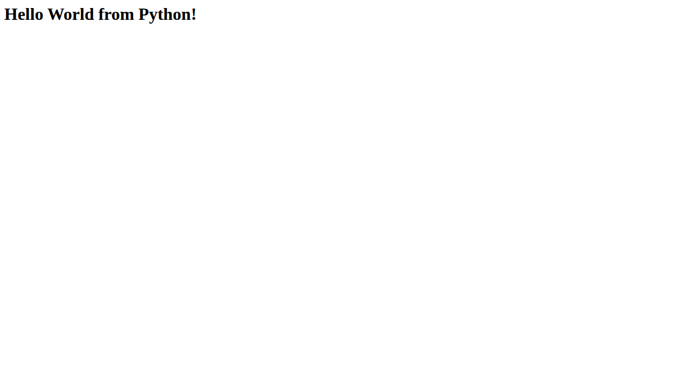
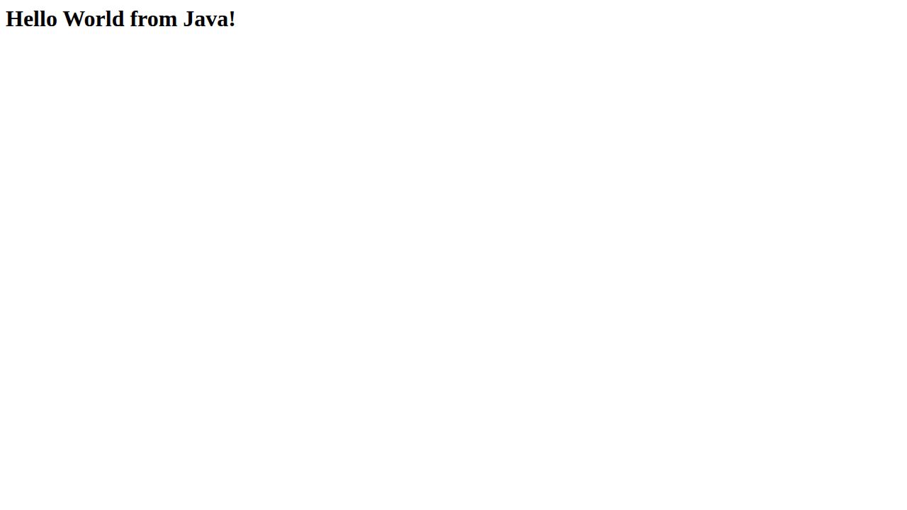
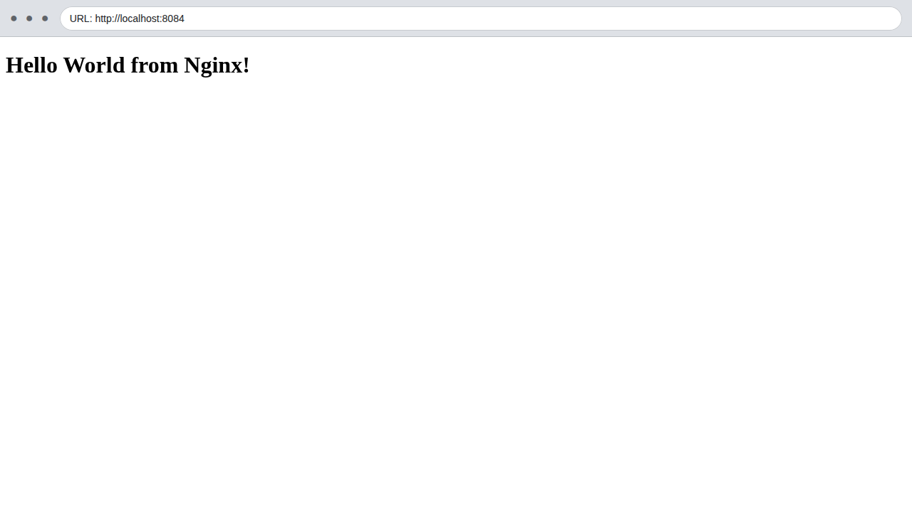
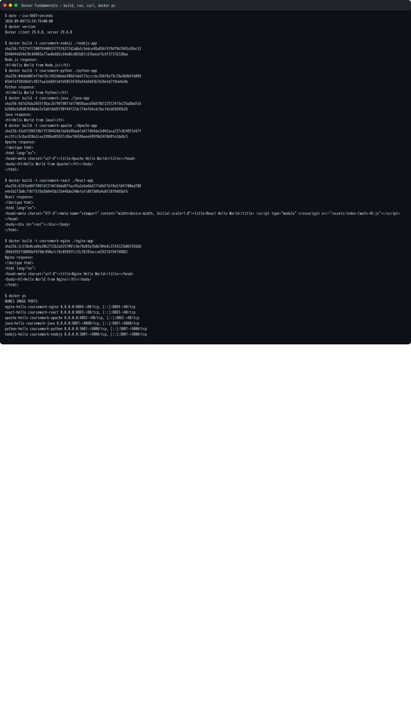

# Docker Fundamentals

Student: **Prabhav Semwal**  
Enrollment number: **24BCS10358**

Each required application has its own source directory and Dockerfile.

| Application | Container port | Build command | Expected page |
| --- | ---: | --- | --- |
| Node.js | 3000 | `docker build -t coursework-nodejs ./nodejs-app` | Hello World from Node.js! |
| Python/Flask | 5000 | `docker build -t coursework-python ./python-app` | Hello World from Python! |
| Java | 8080 | `docker build -t coursework-java ./java-app` | Hello World from Java! |
| Apache | 80 | `docker build -t coursework-apache ./Apache-app` | Hello World from Apache! |
| React | 80 | `docker build -t coursework-react ./React-app` | Hello World from React! |
| Nginx | 80 | `docker build -t coursework-nginx ./nginx-app` | Hello World from Nginx! |

## Build, run, and verify

```bash
docker build -t coursework-nodejs ./nodejs-app
docker run -d --name nodejs-hello -p 3001:3000 coursework-nodejs
curl --fail http://localhost:3001

docker build -t coursework-python ./python-app
docker run -d --name python-hello -p 5001:5000 coursework-python
curl --fail http://localhost:5001

docker build -t coursework-java ./java-app
docker run -d --name java-hello -p 8081:8080 coursework-java
curl --fail http://localhost:8081

docker build -t coursework-apache ./Apache-app
docker run -d --name apache-hello -p 8082:80 coursework-apache
curl --fail http://localhost:8082

docker build -t coursework-react ./React-app
docker run -d --name react-hello -p 8083:80 coursework-react
curl --fail http://localhost:8083

docker build -t coursework-nginx ./nginx-app
docker run -d --name nginx-hello -p 8084:80 coursework-nginx
curl --fail http://localhost:8084
```

The application code is copied into an image during `docker build`. Each
`docker run -d` starts an isolated container and `-p host:container`
publishes its web port. The complete build and HTTP verification transcript is
in [`evidence/docker-fundamentals-output.txt`](evidence/docker-fundamentals-output.txt).

## Headless Chromium screenshots

These PNGs were captured from the running containers with headless Chromium.
Each capture includes a browser-style address bar showing the tested URL.

| Node.js | Python | Java |
| --- | --- | --- |
|  |  |  |

| Apache | React | Nginx |
| --- | --- | --- |
|  |  |  |


