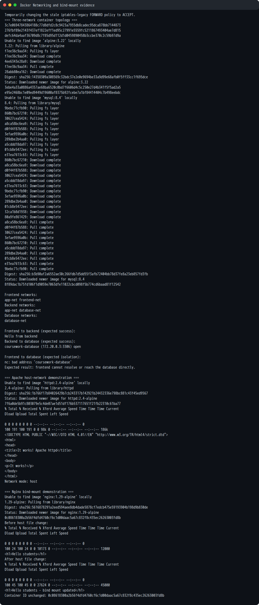

# Docker Networking and Volumes

Student: **Prabhav Semwal**  
Enrollment number: **24BCS10358**

The reproducible [`run-demo.sh`](run-demo.sh) creates the containers,
networks, and bind mount, runs each check, and cleans up only its own named
resources. Real output is in
[`evidence/docker-networking-output.txt`](evidence/docker-networking-output.txt).

## 1. Three-container network topology

```text
coursework-frontend ── frontend-net
        │
      app-net
        │
coursework-backend
        │
   database-net
        │
coursework-database
```

- The Alpine frontend joins `frontend-net` and `app-net`.
- The Alpine backend joins exactly `app-net` and `database-net`.
- The MySQL database joins only `database-net`.
- Docker's embedded DNS lets frontend resolve backend and backend resolve the
  database. The frontend cannot resolve the database because they share no
  network, demonstrating isolation.

The three networks are user-defined bridge networks. Unlike Docker's default
bridge, they provide automatic container-name DNS resolution.

The Codespace combines Docker's nftables backend with a stale legacy
`FORWARD DROP` rule. The demo temporarily changes only that legacy policy to
`ACCEPT`, then restores its original value during cleanup. Docker's own
nftables isolation rules remain active throughout.

## 2. Host network

```bash
docker run -d --name coursework-host-apache --network host httpd:2.4-alpine
curl --fail http://localhost:80
```

With host mode, Apache shares the Docker host's network namespace, so no
`-p` publishing option is used. This works on the Linux Codespace host;
host-mode behavior differs with Docker Desktop's virtual machine.

## 3. Bind mount

The script creates an `index.html` containing **Hello students**, mounts its
directory read-only into Nginx, and accesses it on port 8090. It then changes
the host file and curls the page again. The unchanged container ID proves the
new text appears without restarting the container.

## 4. Overlay networks

An overlay network is a distributed network spanning multiple Docker daemon
hosts. In Docker Swarm, participating hosts exchange network-control
information while VXLAN encapsulates container traffic between hosts.
Services attached to the same overlay can communicate as though they were on
one subnet, even when their tasks run on different machines.

Typical uses include multi-host application tiers, service discovery, and
isolating traffic between distributed services. Swarm manager and worker
nodes must be able to communicate on TCP 2377, TCP/UDP 7946, and UDP 4789.
Encryption of application data can be enabled when creating an overlay.

Sources:

- [Docker overlay network driver](https://docs.docker.com/engine/network/drivers/overlay/)
- [Docker networking drivers](https://docs.docker.com/engine/network/drivers/)

The homework environment is a single Docker host, so I researched the
multi-host behavior rather than presenting a single-host bridge test as an
overlay demonstration.

## Headless Chromium screenshots

| Apache using host networking | Bind mount before editing |
| --- | --- |
|  |  |

The updated page below was captured without restarting Nginx:



