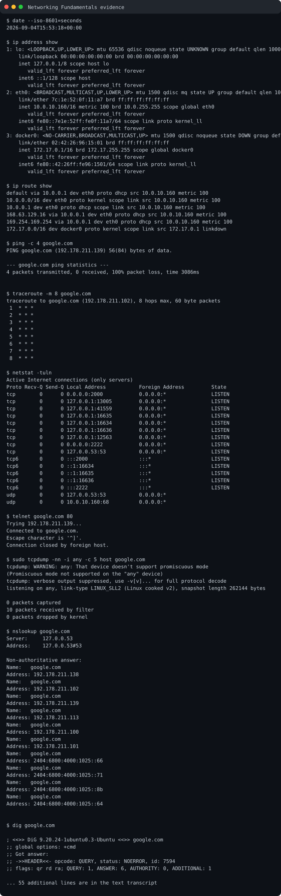

# Networking Fundamentals

Student: **Prabhav Semwal**  
Enrollment number: **24BCS10358**

I followed the
[Network-Troubleshooting exercise](https://github.com/Nency-Ravaliya/Network-Troubleshooting)
shared in the course repository. The complete real run is stored in
[`evidence/networking-output.txt`](evidence/networking-output.txt).

| Command | What I understood |
| --- | --- |
| `ping -c 4 google.com` | Tests IP reachability and round-trip latency using ICMP. A server may block ICMP even when HTTPS works. |
| `traceroute google.com` | Displays routing hops and helps locate delay or packet filtering. Asterisks mean a hop did not reply, not necessarily that forwarding failed. |
| `netstat -tuln` | Lists listening TCP/UDP sockets numerically. `ss -tuln` is the modern Linux alternative. |
| `telnet google.com 80` | Tests whether a TCP connection can be established to a particular host and port. |
| `tcpdump -i any -c 5 host google.com` | Captures packets for protocol-level troubleshooting; elevated privileges are normally required. |
| `nslookup google.com` | Performs a simple DNS lookup and shows the resolver used. |
| `dig google.com` | Shows detailed DNS sections, flags, response time, and record TTLs. |
| `curl -I https://www.google.com` | Tests DNS, TCP, TLS, and HTTP together and returns response headers. |
| `arp -a` | Displays cached IPv4-to-MAC mappings for directly reachable neighbors. `ip neigh` is the modern alternative. |
| `systemctl status NetworkManager` | Checks a network service on a systemd host. A Codespace container may not run NetworkManager or systemd. |

## Troubleshooting order

I would first check local addressing and routes with `ip address` and
`ip route`, then test reachability, DNS, the destination port, HTTP, and
finally packet capture. This narrows the failing layer without starting with
the most invasive tool.

